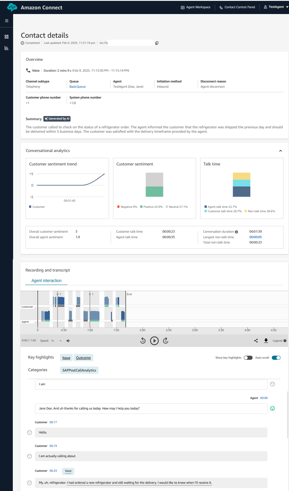

# Amazon Connect Integration with SAP Sales and Service Cloud 
This Guidance demonstrates how to integrate Amazon Connect with SAP Sales and Service cloud. 

## Table of Contents

1. [Overview](#overview)
1. [Prerequisites](#prerequisites)
1. [Deployment Options](#deployment-options)
1. [CDK Deployment](#cdk-deployment)
1. [Deployment Validation](#deployment-validation)
1. [SAP Sales and Service Cloud Configuration](#sap-sales-and-service-cloud-configuration)
1. [End to End Validation](#end-to-end-validation)
1. [Deck and Demo](#deck-and-demo)
1. [Cleanup](#cleanup)
1. [Common Errors and Troubleshooting](#common-errors-and-troubleshooting)
1. [FAQ, known issues, additional considerations, and limitations](#faq-known-issues-additional-considerations-limitations-and-disclaimer)
1. [Revisions](#revisions)
1. [Notices](#notices)
1. [Authors](#authors)

## Overview

SAP Service Cloud is a cloud-based customer service and support solution offered by SAP. It is designed to help organizations improve their customer service operations and enhance the overall customer experience. SAP Sales Cloud is a customer relationship management (CRM) platform that helps sales teams automate and streamline sales processes. The Solution Guidance provides an Amazon Connect connector for SAP Sales and Service Cloud, which is a CTI (Computer Telephony Integration) widget for omnichannel communication. By using this integration, businesses can enhance customer engagement and streamline contact center operations with a unified view of customer data with GenAI capabilities.

### Solution Overview
This architecture diagram illustrates how to effectively integrate Amazon Connect with SAP Sales and Service Cloud on AWS.
It shows the key components and their interactions, providing an overview of the architecture's structure and functionality.

<kbd></kbd>

1a. SAP manages Sales and Service Cloud (S&SC) as a SaaS-solution hosted in their AWS environment. 

1b. The solution deploys Customer Control Panel (CCP) to an Amazon S3 and makes it available via Amazon CloudFront. An admin user deploys sample code from this Guidance to integrate CCP with SAP S&SC via iFrame integration within the browser.

1c. An agent logs in to to SAP S&SC and then to custom CCP with his/her Amazon Connect agent credentials and sets him/herself available. 

2\. An end-customer with an issue calls the help desk number. 

3a. Amazon Connect routes the call to the available agent. 

3b. Custom CCP communicates with SAP S&SC via browser events. SAP S&S Cloud processes the information it received via browser events. 

4\. When call ends, Amazon Connect sends call summary to the respective S3 bucket. 

5\. Post that, Amazon Connect sends an event to Amazon EventBridge. 

6\. Amazon EventBridge triggers a Lambda function based on a rule match. 

7\. Based on the event details, the Lambda function fetches the call summary from the S3 bucket. 

8\. Using a REST API provided by Amazon API Gateway, the Lambda function sends the summary to SAP S&SC, which displays the call summary as part of the call record.

### Cost
For a new Amazon Connect instance, let's consider a scenario where a single agent handles 10 inbound calls daily through a US toll-free number, working 22 days per month with Contact Lens enabled. Assuming each call has an average handling time of 5 minutes, we can calculate the following costs:

* The per-minute charges break down into three components: Amazon Connect service charge of $0.018, a toll-free charge of $0.06, and a Contact Lens conversational analytics fee of $0.015. When we calculate the daily cost for an agent handling 50 minutes of calls (10 calls at 5 minutes each), multiplied by the total per-minute charges ($0.018 + $0.06 + $0.015), we arrive at $4.65 per day per agent.
* Over a 22-working-day month, this amounts to $102.30 per agent for Amazon Connect with Contact Lens conversational analytics. 
* The integration architecture includes additional components: Amazon S3, Amazon CloudFront, and AWS Lambda. These infrastructure costs are quite minimal at scale. For instance, with 1000 agents accessing the static website once daily, each service (S3, CloudFront, and Lambda) would cost less than $1 per month, totaling just $3 monthly for all 1000 agents, or $0.003 per agent per month. For organizations that already have Amazon Connect with Contact Lens in place, the integration cost above would be the only additional cost. 
* When including integration costs, the total comes to approximately $103.00 per agent per month under these parameters.

The following table provides a sample cost breakdown for deploying this Guidance in the US East (N. Virginia) Region for one month.

#### Cost Table

| AWS Service | Dimensions | Cost [USD] Daily Cost | Cost [USD] Monthly Cost | 
|---|---|---|---|
| Amazon Connect (per agent) | Includes Toll Free number and Contact lens; agent 50 mins of calls per day  | $4.65 (daily cost) | $102.30 |
| Amazon S3 + Amazon CloudFront + AWS Lambda (per agent) | Integration component cost |   | $ 0.003 |
| Total (per agent) |   |   | ~ $103 |

## Prerequisites
- Ensure you have a new AWS Account that is already activated
- User with Admin rights to the account
- SAP Sales and Service Cloud environment (if you want to test end to end integration)
- Familiarity with AWS cloud concepts and experience working with AWS is expected
- **AWS Region consideration**: The solution should deployed in one of the following AWS regions due to dependency on availability of Amazon Connect, Contact Lens and GenAI contact summaries features used in Connect. For a full list of Amazon Connect supported AWS regions and features per region, refer to this [link](https://docs.aws.amazon.com/connect/latest/adminguide/regions.html#contactlens_region). 
    * US East (N. Virginia) 
    * US West (Oregon)
    * Asia Pacific (Sydney)
    * Asia Pacific (Tokyo)
    * Canada (Central)
    * Europe (London)
- **Language Support**: The Solution Guidance supports the languages supported by Amazon Connect. Please see this [link](https://docs.aws.amazon.com/connect/latest/adminguide/supported-languages.html) for Amazon Connect language support for different Amazon Connect features. The key Amazon Connect features used in this solution include: Contact Control Panel (CCP), Contact lens features like post call analytics, sentiment analysis and GenAI post contact summaries. 

## Deployment Options
There are two options for deployment:
1. **CDK Deployment:** The CDK deploys a new Amazon Connect instance, it deploys the connector and additional components as shown in the architecture diagram. This is a great way to get started on a new POC environment and learn the solution so you can further modify it for your needs. The CDK steps can be referenced [below](#cdk-deployment)
1. **Manual deployment:** Customers with existing Amazon Connect may choose to deploy the solution manually. The manual steps can be referenced [here](manual-setup/manual_setup_readme.md)

## CDK Deployment
The CDK deployment process is based on [AWS CDK](https://aws.amazon.com/cdk/).

### CDK Deployment Prerequisites:
- The CDK uses Typescript as the programming language. Follow these [AWS CDK prerequisites](https://docs.aws.amazon.com/cdk/v2/guide/prerequisites.html) steps.
- Install the latest version of [AWS CDK](https://docs.aws.amazon.com/cdk/v2/guide/getting_started.html#getting_started_install).
- Install Docker Desktop: [Mac](https://docs.docker.com/desktop/setup/install/mac-install/), [Windows](https://docs.docker.com/desktop/setup/install/windows-install/), or [Linux](https://docs.docker.com/desktop/setup/install/linux/). Launch Docker service (eg: DockerDesktop in macos).

### CDK Deployment Steps:
1. **Clone the repository** in a directory of your choice:
```bash
⚡ git clone https://github.com/aws-solutions-library-samples/guidance-for-integrating-amazon-connect-with-sap-sales-and-service-cloud-on-aws.git
```

2. **Initialize the CDK project** and install all the required dependencies:
```bash
⚡ cd guidance-for-integrating-amazon-connect-with-sap-sales-and-service-cloud-on-aws/cdk
⚡ npm install
```
3. **CDK Bootstrap** - follow the [bootstrap process](https://docs.aws.amazon.com/cdk/v2/guide/bootstrapping-env.html) prior to deployment:
```bash
⚡ cdk bootstrap aws://AWS_ACCOUNT_NUMBER/AWS_REGION
```
The bootstrap must be performed in all the AWS regions where you want to deploy the solution. Example:
```bash
⚡ cdk bootstrap aws://XXXXXXXXXXXX/us-east-1
```
The [output](docs/BootStrap.png) shows the AWS resources created by the CDK bootstrapping process. 

4. **CDK Deployment** - deploy the CDK solution with the required parameters in the region of your choice. Ensure you have set the environment variable ```AWS_REGION``` with the region where you want to deploy.

Ensure you are using unique values for 'AmazonConnectInstanceAliasParam', 'AppConnectorBucketNameParam' and 'ConnectBucketNameParam'. Also ensure you are using right values for c4cBaseUrlParam, c4cUsernameParam, c4cPasswordParam which are the base service URL and credentials needed to authenticate to the SAP Sales and Service cloud REST API. Also please take a look at [Common Errors and Troubleshooting](#common-errors-and-troubleshooting) section. 

```bash
⚡ export AWS_REGION=<DESIRED AWS REGION>   && \                                                                           
    cdk deploy \
        --parameters AmazonConnectInstanceAliasParam=<DESIRED CONNECT ALIAS NAME>  \
        --parameters EnvironmentParam=<ENVIRONMENT VALUE> \
        --parameters AppConnectorBucketNameParam=<BUCKET NAME FOR CONNECTOR APPLICATION>  \
        --parameters ConnectBucketNameParam=<BUCKET NAME FOR AMAZON CONNECT INSTANCE NAME> \
        --parameters AdminUserNameParam=<ADMINISTRATOR USERNAME> \
        --parameters AdminPasswordParam=<ADMINISTRATOR PASSWORD> \
        --parameters AdminFirstNameParam=<ADMINISTRATOR FIRSTNAME> \
        --parameters AdminLastNameParam=<ADMINISTRATOR LASTNAME> \
        --parameters AdminMailParam=<ADMINISTRATOR EMAIL> \
        --parameters AgentUserNameParam=<AGENT USERNAME> \
        --parameters AgentPasswordParam=<AGENT PASSWORD> \
        --parameters AgentFirstNameParam=<AGENT FIRSTNAME> \
        --parameters AgentLastNameParam=<AGENT LASTNAME> \
        --parameters AgentMailParam=<AGENT EMAIL> \
        --parameters c4cBaseUrlParam=<BASE URL OF SAP SALES AND SERVICE CLOUD SUBSCRIPTION> \
        --parameters c4cPhoneServiceEndpointParam=<ENDPOINT OF THE PHONE SERVICE ENDPOINT IN SAP> \
        --parameters c4cUsernameParam=<USERNAME IN SAP SALES AND SERVICE CLOUD> \
        --parameters c4cPasswordParam=<PASSWORD IN SAP SALES AND SERVICE CLOUD>
```
Here is an example:

```bash
 ⚡ export AWS_REGION=us-east-1 && \
    cdk deploy --parameters AmazonConnectInstanceAliasParam=test-instance \
        --parameters EnvironmentParam=poc \
        --parameters AppConnectorBucketNameParam=test-instance-poc-app-us-east-1 \
        --parameters ConnectBucketNameParam=test-instance-poc-connect-us-east-1 \
        --parameters AdminUserNameParam=TestAdmin \
        --parameters AdminFirstNameParam=John \
        --parameters AdminLastNameParam=Doe \
        --parameters AdminMailParam=john.doe@example.com \
        --parameters AdminPasswordParam=Password2025 \
        --parameters AgentFirstNameParam=Jane \
        --parameters AgentLastNameParam=Doe \
        --parameters AgentMailParam=jane.doe@example.com \
        --parameters AgentPasswordParam=Password2025 \
        --parameters AgentUserNameParam=TestAgent \
        --parameters c4cBaseUrlParam=https://myXXXX.XX.demo.crm.cloud.sap \
        --parameters c4cPhoneServiceEndpointParam=/sap/c4c/api/v1/phone-service/ \
        --parameters c4cUsernameParam=sapusername \
        --parameters c4cPasswordParam=Password2025
```

When the deployment is successful you will get the following output, make a note of the 'AmazonConnectInstanceURL', 'AmazonConnectPhoneNumber' and 'CloudFrontDistributionURL'.

<kbd></kbd>

To see the full set of resources deployed by CDK via the CloudFormation template, you can navigate to your AWS CloudFormation Console and review the **Resources** for `AmazonConnectFullStack`. Here is a [sample](docs/CFResources.png) resources list from the CloudFormation. 

To gain deeper understanding of deployed resources by CDK, you can review the manual deployment guide [here](manual-setup/manual_setup_readme.md). The CDK has automated all the steps from the manual deployment. 

## Deployment Validation
### Test the Cloudfront URL to login to Amazon Connect

1. In a new browser session, example: using Chrome's ingonito mode, or another browser like Microsoft Edge.
2. Navigate to your Cloudfront URL like `https://d23xxxxxxx.cloudfront.net`, using 'CloudFrontDistributionURL' from cdk deploy outputs.
3. Allow pop-ups in the browser, in the login pop-up that comes up, login using an 'AgentUserNameParam' and 'AgentPasswordParam' as specified in the cdk deploy.
4. Make agent status as available.
5. Make a phone call with the phone number from cdk deploy outputs - 'AmazonConnectPhoneNumber'.

## SAP Sales and Service Cloud Configuration
### Configure SAP Service Cloud CTI adapter

1. Login to SAP Service Cloud
2. Click on the user icon on top right and select **Settings** 
3. Select **All settings** -> **CTI configuration**
4. Select **Amazon Connect** under **Communication Provider**
5. Enter the Cloudfront URL in **Provider URL** field, like `https://d23xxxxxxx.cloudfront.net`.

<kbd></kbd>

6. Under **Settings** → **Content Security policy settings** - add the Cloudfront URL domain like `d23xxxxxxx.cloudfront.net` in Content Security Policy Setting for all the sections.

<kbd></kbd>

## End to End Validation
1. Login to SAP Service Cloud
2. On the top right click on 'CTI-Widget' icon
3. The Connector shows up in right and you get a Amazon Connect Login prompt
4. Login to Amazon Connect using the 'AgentUserNameParam' and 'AgentPasswordParam' values that you provided during 'cdk deploy'

<kbd></kbd>

5. Once you login, you can close the pop-up. Refresh the page if required, in the Connector on the right side change agent status to 'Available'

<kbd></kbd>

6. Make a phone call using 'AmazonConnectPhoneNumber' output parameter value obtained from CDK deploy
7. SAP Service Cloud is able to pull up the contact based on the incoming phone call number. A new timeline entry is created for the incoming call.

<kbd></kbd>

8. Once the agent completes helping the customer and the call completes, you can end the call and click close contact in the Connector. When you refresh in the timeline, you will see the PhoneTranscriptSummary as shown below. (Please note some times the phone transcript summary may take ~5mins to show up after 'Close Contact" action is done in the Connector).

<kbd></kbd>

9. Clicking on "Phone Trancscript' will bring up a page like below with all the call details. You can see information of the call, the call summary, conversational analytics, customer sentiment, talk time, call recording and call transcript along with sentiment analysis.

<kbd></kbd>

## Deck and Demo

Here is a PowerPoint deck and a recorded demo for reference. 
[PowerPoint Deck](docs/Guidance-for-Integrating-Amazon-Connect-with-SAP-on-AWS.pdf)

[](https://www.youtube.com/watch?v=33PAQmyRFB8)

## Cleanup

To clean up the resources created during the CDK deployment, follow these steps:
```bash
⚡ export AWS_REGION=<DESIRED REGION> && cdk destroy
```
Please consider that the Amazon S3 bucket used by Amazon Connect to store call recordings and translations must be [emptied](https://docs.aws.amazon.com/AmazonS3/latest/userguide/empty-bucket.html) before running ```cdk destroy```, otherwise the destroy command will fail.

## Common Errors and Troubleshooting
### Errors
1. CDK deploy can fail if unique values are not provided for 'AmazonConnectInstanceAliasParam', 'AppConnectorBucketNameParam' and 'ConnectBucketNameParam'.
2. Sometimes Amazon Connect phone number may not be successfully claimed by CDK, in that case you will see an error in `cdk deploy` step: "*Received response status [FAILED] from custom resource. Message returned: User: arn:aws:sts::... is not authorized to perform: connect:AssociatePhoneNumberContactFlow on resource: arn:aws:connect:...*". In that case you will need to (a) Delete the S3 bucket and its content created in the AWS account with name that you proivided in `AppConnectorBucketNameParam` in cdk deploy. (b) Go to CloudFormation console and delete the `AmazonConnectFullStack`, (c) rerun the `cdk deploy` step. 

## FAQ, Known Issues, Additional Considerations, Limitations and Disclaimer

### Known Issues
* Currently deploying the solution to AWS Frankfurt region is not supported due to a known issue that is being worked on. Please see [Prerequisites](#prerequisites) section for list of regions supported.

### Disclaimer
*The sample code; software libraries; command line tools; proofs of concept; templates; or other related technology (including any of the foregoing that are provided by our personnel) is provided to you as AWS Content under the AWS Customer Agreement, or the relevant written agreement between you and AWS (whichever applies). You should not use this AWS Content in your production accounts, or on production or other critical data. You are responsible for testing, securing, and optimizing the AWS Content, such as sample code, as appropriate for production grade use based on your specific quality control practices and standards. Deploying AWS Content may incur AWS charges for creating or using AWS chargeable resources, such as running Amazon EC2 instances or using Amazon S3 storage.*

## Revisions
1.0 - Initial Release - March 2025

## Notices
*Customers are responsible for making their own independent assessment of the information in this Guidance. This Guidance: (a) is for informational purposes only, (b) represents AWS current product offerings and practices, which are subject to change without notice, and (c) does not create any commitments or assurances from AWS and its affiliates, suppliers or licensors. AWS products or services are provided “as is” without warranties, representations, or conditions of any kind, whether express or implied. AWS responsibilities and liabilities to its customers are controlled by AWS agreements, and this Guidance is not part of, nor does it modify, any agreement between AWS and its customers.*

## Authors
- Rajeswari Malladi
- Clarence Choi
- Francesco Bersani
- Abhijeet Jangam
- Felix Wegner
- Rathish Soundarapandian